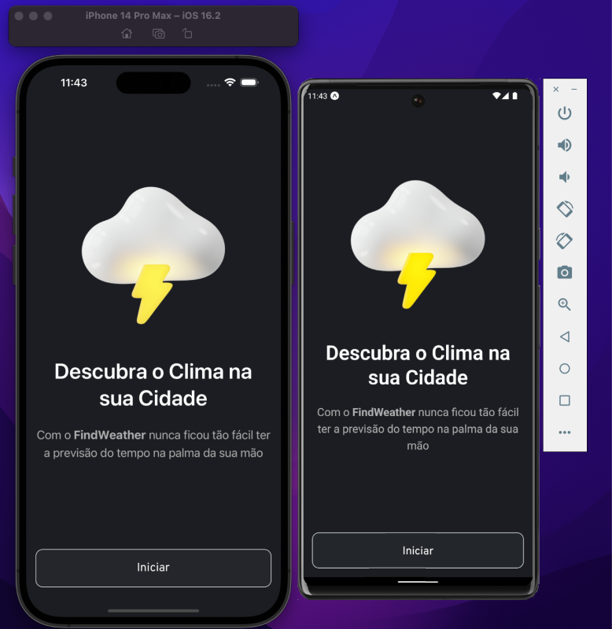
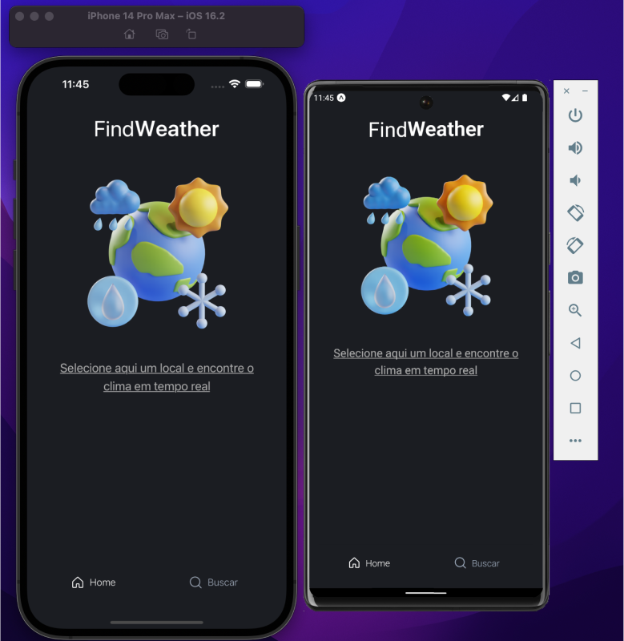
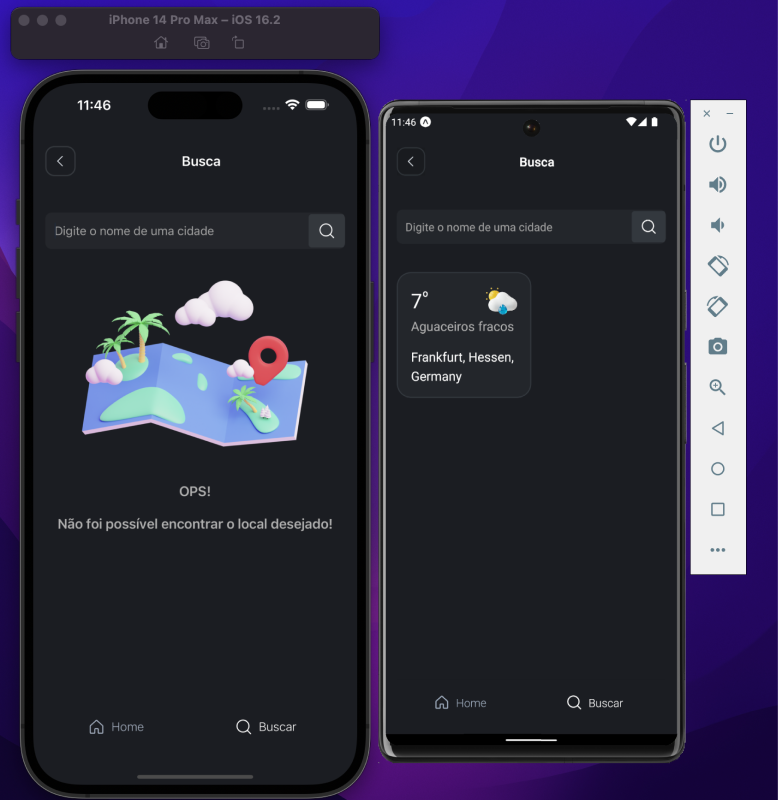
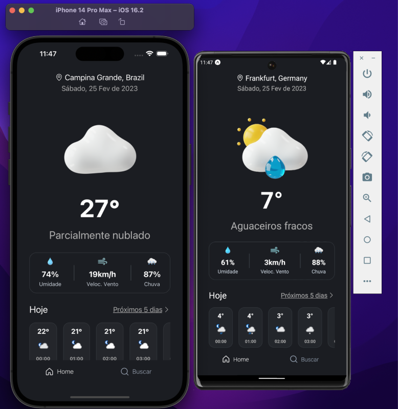
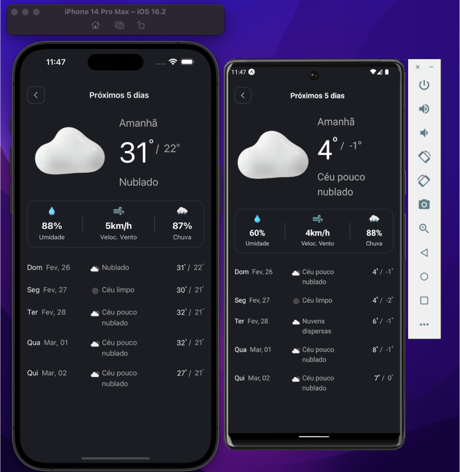

## :octocat: Menu
- [:octocat: Menu](#octocat-menu)
- [:cloud\_with\_lightning\_and\_rain: Sobre o projeto](#cloud_with_lightning_and_rain-sobre-o-projeto)
- [:camera: Imagens finais](#camera-imagens-finais)
- [:computer: Como rodar o projeto](#computer-como-rodar-o-projeto)
- [:wrench: Tecnologias utilizadas](#wrench-tecnologias-utilizadas)
- [:man_technologist: Dev](#woman_technologist-dev)

## :cloud_with_lightning_and_rain: Sobre o projeto

Com o FindWeather você será capaz de buscar por uma cidade ou país para visualizar o clima em tempo real. Além disso, será possível visualizar também a temperatura dos próximos 5 dias ☔️.


## :camera: Imagens finais











## :computer: Como rodar o projeto

Primeiro é necessário clonar o projeto.
Além disso garanta que você tenha seu ambiente configurado com:

- Yarn
- NodeJS
- Android Studio
- Xcode (caso você tenha um dispositivo macOS)
- Expo CLI instalado

Depois do clone rode:

```bash
cd findWeather
yarn install
npx expo start -c
a -> para abrir no emulador Android
i -> para abrir no emulador iOS
```

## :wrench: Tecnologias utilizadas

- TypeScript
- Axios
- Day.js
- Native base
- Async Storage
- React Navigation
- Expo bare workflow
- External API's
- External font by Google


## :man_technologist: Dev

Meu nome é Lucas Lima, e foi um prazer criar esse aplicativo e toda sua interface.
Para saber mais detalhes sobre minha carreira acesse meu [LinkedIn](https://www.linkedin.com/in/lucasarl1m/) 👨‍💻.

Made by Lucas.
